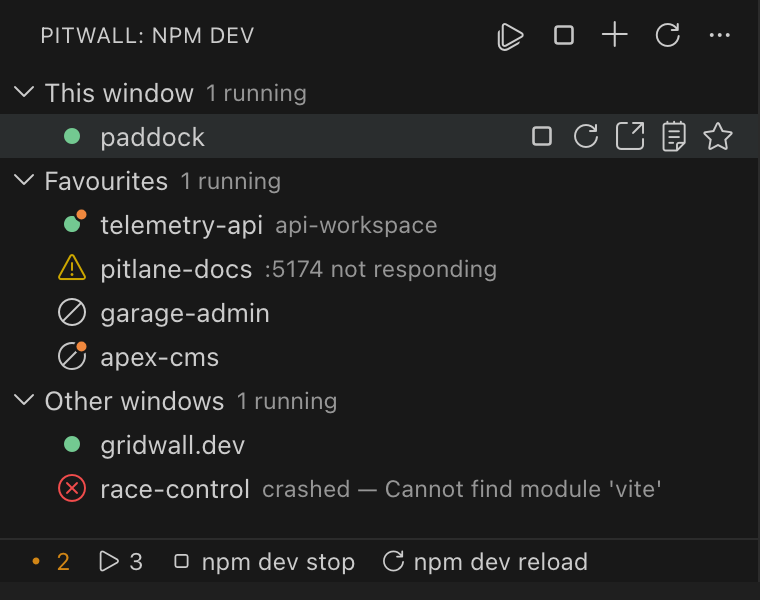

# Pitwall

*Every open VS Code window, its dev server and its Claude session — in one panel.*

*[Türkçe](README.tr.md)*



## Features

- **All your projects in one list** — this window's folders, your favourites and the projects of every other open VS Code window. Favourites stay listed when their window is closed; starting one runs it from here.
- **Jump between windows** — click a row to bring its window to the front. A project that isn't open anywhere opens in a new window. Clicking never starts a server — only `▶` does.
- **Dev servers without terminal tabs** — start, stop and restart `npm run dev` from the row, the panel title or the status bar. Output goes to a per-project output channel.
- **Running count** — `▶ 3` in the status bar across all windows, `3 running` on each group.
- **Know when Claude is done** — a small orange dot tells you Claude finished or asked you something in another project. [More below](#claude-sessions).
- **No port fights** — if the port is taken, the next free one is used. No prompts.
- **Self-healing servers** — a crashed or unresponsive server comes back after 3 s. Three failed restarts in a row and Pitwall gives up.
- **Errors on the row** — `Cannot find module`, `npm ERR!` and similar lines show up next to the project name.
- **Opens your app, not the vite port** — `↗` opens `APP_URL` from `.env`, or `https://<folder>.test` for Laravel projects.
- **Auto start** — when a window opens, bring back what was running, your favourites or every root folder.
- **No orphans** — closing a window stops its servers, and leftovers from a crashed window are cleaned up on the next start.
- **`build` is never run** — a production build would break the dev server you have open.
- macOS, Linux and Windows. English and Turkish.

### Status icons

| Icon | Meaning |
|---|---|
| `●` | Running |
| `○` | Stopped |
| `⊘` | Favourite whose window is closed |
| `⚠` | Port not responding |
| `✕` | Crashed |
| orange `•` on the icon | Claude is waiting on you |

A row shows the folder name; the window name is added only when it differs.

## Claude sessions

Give Claude work in several projects, switch to something else, and still remember to come back.

- **The orange dot** appears when Claude finishes a turn or asks a question (`AskUserQuestion`, plan approval) in a window you aren't looking at. The tooltip says which, and when.
- **It clears** when you focus that window or click the row.
- **The status bar** counts waiting projects (`• 2`). Click it to jump to one.
- Covers CLI and VS Code sessions, sessions started in a subfolder, and favourites whose window is closed.

Not detected: permission prompts — Claude Code doesn't log them. The log format isn't a public API, so a Claude Code update may break detection.

> **Privacy:** Pitwall only reads the last lines of Claude Code's session logs (`~/.claude/projects`) on your machine. Nothing is sent anywhere and nothing in `~/.claude` is changed.

## Commands

| Command | Shortcut |
|---|---|
| npm dev start/stop | `⌘⌥D` · `Ctrl+Alt+D` |
| npm dev reload | `⌘⌥R` · `Ctrl+Alt+R` |
| Start everything in the list | |
| Stop everything in the list | |
| Restart every running server | |
| Add folder to favourites | |
| Show projects where Claude is waiting | |

The bulk commands cover every window; work for another window's project is handed to that window.

## Settings

| Setting | Default | Description |
|---|---|---|
| `pitwall.script` | `dev` | npm script to run. Names starting with `build` are rejected. |
| `pitwall.packageManager` | `auto` | `npm`, `pnpm`, `yarn` or `bun`. `auto` reads the lock file. |
| `pitwall.port` | `0` | Port to use. `0` = `server.port` from `vite.config`, otherwise 5173. |
| `pitwall.autoStart` | `lastSession` | What to start when the window opens: `lastSession`, `favorites`, `workspace` or `off`. |
| `pitwall.autoStartOpensUrl` | `false` | Let auto start open the browser too. |
| `pitwall.openUrlOnStart` | `false` | Open the browser when you start a server. |
| `pitwall.url` | `""` | Fixed address to open. Empty = `APP_URL`, then `<folder>.test`, then the server's address. |
| `pitwall.openUrlTimeoutMs` | `15000` | If the server prints no address, open the known one after this delay. |
| `pitwall.revealTerminal` | `false` | Bring the output channel to the front on start. |
| `pitwall.restartDelayMs` | `600` | Wait between the stop signal and a forced kill. |

Every setting can be overridden per folder in a multi-root workspace.

## How it works

- **Windows share state** through `~/.pitwall/`, which VS Code, Cursor, VS Code Insiders and the Pitwall desktop app all read. Each window writes its projects every 5 s; a window silent for 20 s drops off the list.
- **Bulk and auto starts** are spaced 1 s and 1.5 s apart so ports don't race; projects already running in another window are skipped.
- **Ports** handed out are held for 60 s, so two servers starting together never get the same one. An `EADDRINUSE` moves the project to a free port once.
- **Health probe** checks each running server's port every 30 s, on IPv4 and IPv6. Still silent 3 s later means a restart.
- **Stopping** kills the whole process tree, so the `vite` under `npm` goes too: a process group on macOS and Linux, `taskkill /T` on Windows.
- **Orphan cleanup** — each window records its pids. On Windows, where pids are reused quickly, a leftover pid is killed only while it still belongs to `cmd.exe`.
- **Claude "seen" state** is a timestamp per project in `~/.pitwall/`, shared by every window. Work older than the first run counts as seen.

## Install

From the VS Code Marketplace, or grab a `.vsix` from [releases](https://github.com/aenzenith/pitwall-vscode/releases):

```bash
code --install-extension pitwall-vscode-<version>.vsix
```

## Development

```bash
npm install
npm run typecheck
npm test
```

Press **F5** in VS Code to launch an Extension Development Host. CI runs on Linux, macOS and Windows. Releases are cut by [release-please](https://github.com/googleapis/release-please) from Conventional Commits.

## Licence

MIT
